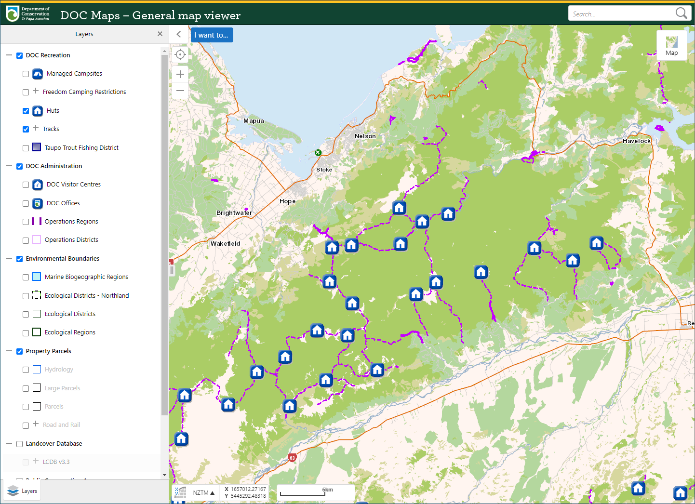
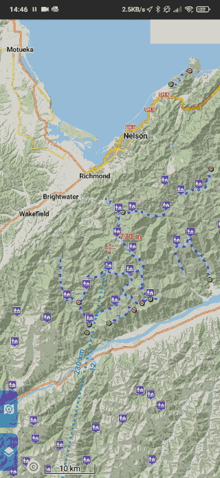

## DOC tramping data on the go

Export DOC map data to a file that you can upload to your phone or mapping application.

Works with Google Maps, Google Earth, Locus and any other application that supports KML files. More filetypes, e.g. GPX, coming soon.

#### DOC online:

#### DOC offline:

Images require internet connection to load.

### Roadmap
* TypesScript (in-progress)
* Front-end to download specific regions only
* Huts
* Support other file formats
* KMZ files that include embedded content like images and brochures
* Richer content in descriptions
